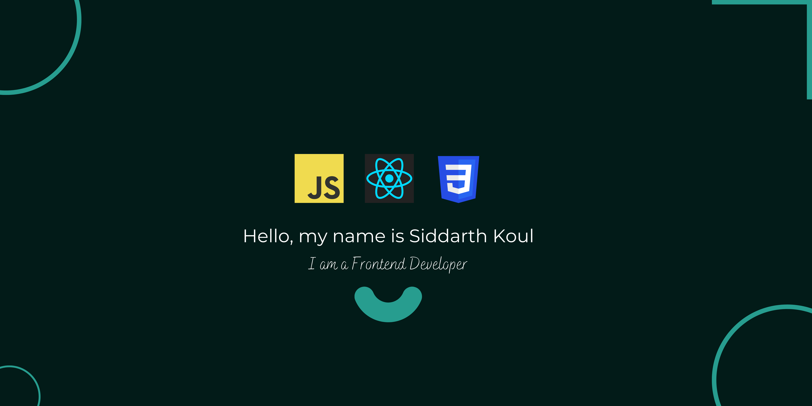

</a>
### Hi there 👋, My Name is Siddarth Koul
#### An Entry Level Frontend Developer.
Entry Level Frontend Developer. Seeking for new opportunities and challenges that will expand my skillset.

Skills: REACT / JS / HTML / CSS

- 🌱 I’m currently learning ReactJS and NodeJS 
- 👯 I’m looking to collaborate on Web Design Projects 
- 💬 Ask me about Python and ReactJS 
- 📫 How to reach me: link.sid59@gmail.com 
- 😄 Pronouns: he/him 
- ⚡ Fun fact: I am a basketball player 

                            

  

  

  
